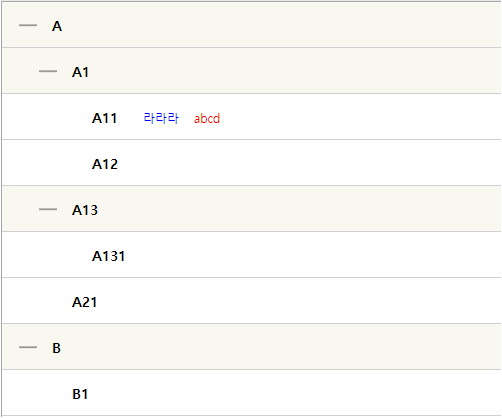

# wiseTreeView
jQuery Plugin TreeView

* 특징

   - 작은 아이콘/폰트때문에 좁고 답답해 보이는 일반적인 TreeView 대신

   - 노드를 시원시원하게 커스터마이징하고, 노드 내부에 html/아이콘 등도 변경할 수 있게 개발 

 

* 사용법 

    <link rel="stylesheet" href="/wise/common/css/jquery-wiseTreeView-1.0.css">

    <!-- 여기에 jquery 모듈 import -->

    

    

    let list = $("#tree");

    위 내용이 공통이며 아래는 샘플 4개로 설명함

    (샘플1 : 3796개 데이터 - 속도 무난함)

    

